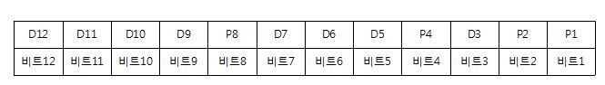
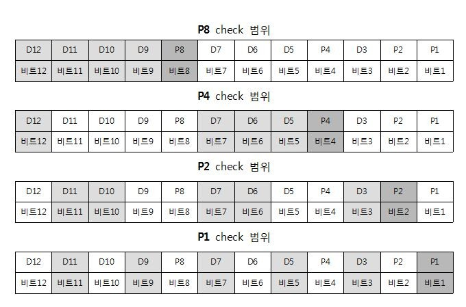

# Hamming Error Correction Code

> reference: https://m.blog.naver.com/ggggamang/221113176831


 * Richard Wesley Hamming의 저서에 소개된 오류 검출 및 정정 알고리즘
 * Hamming ECC는 데이터비트에 몇 개의 체크비트가 `추가`된 코드이다.
 * 에러비트의 위치를 알 수 있으며, 정정할 수 있다.
 * 얼마나 많은 체크 비트가 필요할까?
   * `2^p >= d + p + 1`
   * d는 데이터비트의 비트 수
   * p는 체크비트의 비트 수
   * 위 공식을 만족하는 p가 체크 비트의 개수이다.
   * 데이터 비트가 1 byte라면, d=8이므로, p는 최소 4가 된다.
   * 각 체크 비트의 위치는 2^n (1, 2, 4, 8, ...)번째에 순서대로 삽입된다. 



> 1byte의 데이터에 대해 위 이미지와 같이 체크비트가 붙는다.


> 각 체크비트는 위 이미지와 같은 패리티 체크 범위를 갖는다.

 * 패리티 체크
   * 짝수패리티의 경우, 데이터비트에서 1의 갯수가 홀수일 경우, 패리티비트가 1을 추가하여 총 짝수를 만드는 것
   * 짝수 패리티의 경우 P4는 D12, D7, D6, D5를 중 1의 개수가 홀수면 패리티 비트가 1이 되어 1의 개수를 짝수를 만듦
   * n 번째 체크 비트는 자기 자신을 포함하여 2^(n-1)칸 보고 2^(n-1)칸 건너띄는 식으로 검사한다.
 
 * 오류 검사
   * 만약 P2, P4에 오류가 확인되면 오류확인 비트는 1010이 되며, 이는 10진수로 10이므로 D10에 오류가 생긴 셈.
   * D10을 뒤집으면 오류 정정이 된다.  


# 예제

> 짝수 패리티를 갖는 7비트의 데이터 `0011111`이 수신되었다. 해밍코드를 이용하여 전송 중 발생한 오류를 찾아 바르게 정정한 것은?

 
 * 7비트이므로 데이터 비트는 총 4개, 체크비트는 총 3개

```
  P1  P2  D3  P4  D5  D6  D7
   0   0   1   1   1   1   1

  P1 검사 -> P1, D3, D5, D7 -> 1이 3개이므로 오류
  P2 검사 -> P2, D3, D6, D7 -> 1이 3개이므로 오류
  P4 검사 -> P4, D5, D6, D7 -> 1이 4개이므로 정상
  
  즉, P4 P2 P1 = 0 1 1 -> 3번째 비트에 오류 발생

  따라서 D3을 뒤집으면  0 0 0 1 1 1 1

```